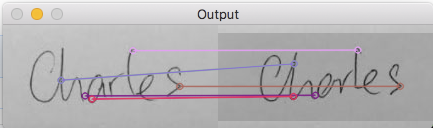

# opencv 

## compare.py
Signature verification based on OpenCV libraries. It uses SIFT image feature detection algorithm. The signature verification is built upon image feature recognition and a comparison of the captured feature 

## Sample output

